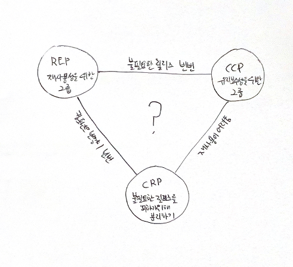

# 13. 컴포넌트 응집도

어떤 클래스를 어느 컴포넌트에 포함시켜야 하는지에 대한 세가지 원칙.

### REP: 재사용/릴리즈 등가 원칙

재사용 단위는 릴리즈 단위와 같다.  
소프트웨어 컴포넌트가 릴리즈 절차를 통해 추적 관리되지 않거나 릴리즈 번호가 부여되지 않는다면 해당 컴포넌트를 재사용하고 싶어도 할 수도 업속, 하지도 않을 것이다.

단일 컴포넌트는 응집성 높은 클래스와 모듈들로 구성되어야 한다.  
컴포넌트를 구성하는 모든 모듈은 서로 공유하는 중요한 테마나 목적이 있어야 한다.  

하나의 컴포넌트로 묶인 클래스와 모듈은 반드시 함께 릴리즈할 수 있어야 한다.  
하나의 컴포넌트로 묶인 클래스와 모듈은 버전 번호가 같아야 하며, 동일한 릴리즈로 추적 관리되고, 동일한 릴리즈 문서에 포함되어야 한다.

### CCP: 공통 폐쇄 원칙

동일한 이유로 동일한 시점에 변경되는 클래스를 같은 컴포넌트로 묶어라.  
단일 컴포넌트는 변경의 이유가 여러 개 있어서는 안된다.  (SRP에서 단일 클래스는 변경의 이유가 여러 개 있어서는 안된다는 것과 마찬가지로)

유지보수성은 재사용성보다 훨씬 중요하다.  
변경을 단일 컴포넌트로 제한할 수 있다면, 해당 컴포넌트만 재배포하면 된다.  

물리적 또는 개념적으로 강하게 결합되어 항상 함께 변경되는 클래스들은 하나의 컴포넌트에 속해야 한다.  
이를 통해 소프트웨어를 릴리즈, 재검증, 배포하는 일과 관련된 작업량을 최소화할 수 있다.

### CRP: 공통 재사용 원칙

같이 재사용되는 경향이 있는 클래스와 모듈들은 같은 컴포넌트에 포함해야 한다.  

대체로 재사용 가능한 클래스는 재사용 모듈의 일부로써 해당 모듈의 다른 클래스와 상호작용하는 경우가 많다.  
이런 클래스들이 동일한 컴포넌트에 포함되어야 한다.  

어떤 컴포넌트가 다른 컴포넌트를 사용하면, 두 컴포넌트 사이에는 의존성이 생겨난다.  
의존하는 컴포넌트가 있다면 해당 컴포넌트의 모든 클래스에 대해 의존함을 인지해야 한다.  

CRP는 어떤 클래스를 한데 묶어도 되는지보다는, 어떤 클래스를 한데 묶어서는 안 되는지에 대해서 훨씬 더 많은 것을 이야기한다.  
CRP는 강하게 결합되지 않은 클래스들을 동일한 컴포넌트에 위치시켜서는 안된다고 말한다.

필요하지 않은 것에 의존하지 말라.  

### 컴포넌트 응집도에 대한 균형 다이어그램

REP와 CCP는 포함 원칙이다. 두 원칙은 컴포넌트를 더욱 크게 만든다.  
CRP는 배제 원칙이다. 컴포넌트를 더욱 작게 만든다.  
이 원칙들이 균형을 이루는 방법을 찾아야 한다.

일반적으로 프로젝트는 삼각형의 오른쪽에서 시작하는 편이며, 오직 재사용성만 희생하면 된다.  
프로젝트가 성숙하고, 그 프로젝트로부터 파새왼 또 다른 프로젝트가 생기면 삼각형에서 점차 왼쪽으로 이동해 간다.  
즉, 프로젝트의 컴포넌트 구조는 시간과 성숙도에 따라 변한다.