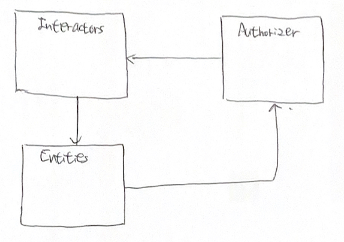
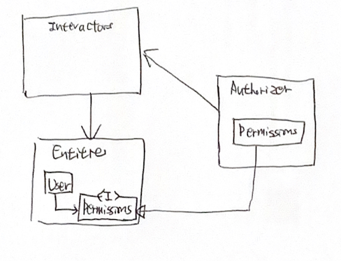

# 14. 컴포넌트 결합

컴포넌트 사이의 관계를 설명하는 세 가지 원칙.

### ADP: 의존성 비순환 원칙

컴포넌트 의존성 그래프에 순환이 있어서는 안 된다. 

컴포넌트 사이에서 순환이 일어나면 안된다고 한다.  
하나의 컴포넌트만 수정해도 순환 의존성을 갖는 다른 컴포넌트까지 영향을 미치기 때문에 사실상 하나의 거대한 컴포넌트가 되어 버린다.  

아래와 같은 순환 의존성을 갖는 컴포넌트들이 존재한다고 할때

컴포넌트 사이의 순환을 끊어야 하는데, 방법은 두 가지 정도 존재한다.
1. 의존성 역전 원칙(DIP)을 적용한다.  
User가 필요로 하는 메서드를 제공하는 인터페이스를 Entities 컴포넌트 안에 생성하고, 해당 인터페이스를 상속받는 클래스를 Autorizer 컴포넌트 안에 생성한다.  
이렇게 하면 Entities와 Authorizer 컴포넌트 사이의 의존성을 역전시킬 수 있고, 순환을 끊을 수 있다.

 
2. Entities와 Authorizer가 모두 의존하는 새로운 컴포넌트를 만든다.  
두 컴포넌트가 모두 의존하는 클래스들을 새로운 컴포넌트로 이동시킨다.

   

요구사항이 변경되면 컴포넌트 구조도 변경될 수 있다.  
애플리케이션이 성장함에 따라 컴포넌트 의존성 구조는 서서히 흐트러지며 또 성장한다.  
순환이 발생하면 끊어야 하며, 그렇게 되면 때론 새로운 컴포넌트를 생성하거나 의존성 구조가 더 커질 수 있다.