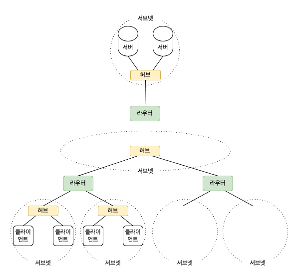

# 02. 웹 서버의 IP 주소를 DNS 서버에 조회한다

### IP 주소의 기본

HTTP 의 메시지를 만들면 OS 에 의뢰하여 엑세스 대상의 웹 서버에 송신한다.  
이때 URL 안에 스여있는 서버의 도메인명에서 IP 주소를 조사해야 한다.

TCP/IP 네트워크는 작은 서브넷을 라우터로 연결하여 전체 네트워크를 완성한다.  
1. 서브넷을 주소의 동에 해당하는 것으로 생각하고 ㅇㅇ동 ㅇㅇ번지 라는 형태의 네트워크 주소를 할당한다.  
2. 통신 데이터의 받는 사람 기입란에 액세스 대상의 주소를 기입하여 데이터를 보낸다.
3. 라우터가 받는 사람을 보고 이것이 어느 방향에 있는지 조사하여 그 방향으로 데이터를 중계한다.  
4. 이 중계 동작을 반복하면 액세스 대상에 데이터가 도착한다.

### 도메인명과 IP 주소를 구분하여 사용하는 이유

숫자를 나열한 IP 주소는 기억하기 어렵기 때문에 도메인명으로 쓸 수 있도록 하였다.

그렇다면 IP 주소 같은 것은 없애고 이름으로 상대를 지정하여 통신하는 것은 어떨까?  
실제 효율이라는 관점에서 보면 좋은 방법이 아니다.

IP 주소는 32비트, 즉 4바이트에 해당하는 개수밖에 없지만, 도메인명은 수십 바이트에서 255바이트까지의 문자를 취급해야 해서 라우터가 부하되어 데이터를 운반하는 동작에 더 많은 시간이 걸리게 된다.  
따라서 도메인명을 그대로 사용하여 상대와ㅑ 통신하는 것은 현명한 방법이 아니다.

사람은 도메인명을 사용하고, 라우터는 IP 주소를 사용한다는 방법이 고안되었고, 현재 이 방법이 정착되었다.  
도메인명을 알면 IP 주소를 알 수 있다거나 IP 주소를 알면 도메인명을 알 수 있따는 원리를 사용하여 양쪽의 차이를 해소하면 모두 좋아지는데, 그 원리가 DNS 이다. 