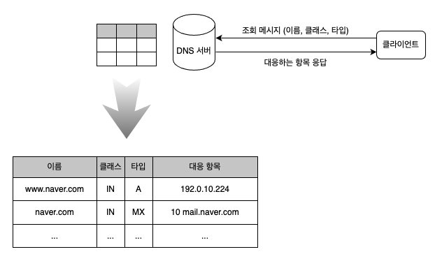
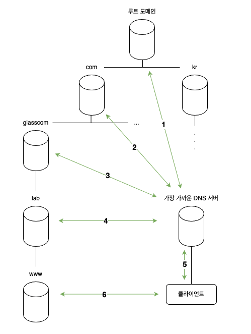

# 03. 전 세계의 DNS 서버가 연대한다

### DNS 서버의 기본 동작

DNS 서버가 받은 조회 메시지는 다음 세 가지 정보가 포함되어 있다.
1. 이름
   - 서버나 메일 배송 목적지
2. 클래스
   - 인터넷 이외에도 네트워크에서의 이용까지 식별하기 위한 값
   - 지금은 인터넷 이외의 네트워크는 소멸되어 항상 인터넷을 나타내는 'IN' 값
3. 타입
   - 이름에 어떤 타입의 정보가 지원되는지를 나타내기 위한 값
   - 'A' 이면 이름에 IP 주소가 지원되는 것을 나타내며, 'MX' 이면 이름에 메일 배송 목적지가 지원된다는 것을 나타냄
   - 타입에 따라 클라이언트로 응답하는 내용이 달라짐
   
DNS 서버에는 이들 세 가지 정보에 대응하는 클라이언트에 응답하는 항목을 등록해 두었다.



실제로는 등록 정보가 설정 파일 등에 입력되어 있다.  
위 표의 1행 정보에 해당하는 것을 **리소스 레코드**라고 부른다.

### 도메인의 계층

인터넷에는 막대한 수의 서버가 있으므로 이것을 전부 1대의 DNS 서버에 등록하는 것은 불가능하다.

정보를 분산시켜서 다수의 DNS 서버에 등록하고, 다수의 DNS 서버가 연대하여 어디에 정보가 등록되어 있는지를 찾아내는 구조이다.

DNS 서버에 등록한 정보에는 모든 도메인명이라는 계층적 구조를 가진 이름이 붙여져 있다.  
계층화해서 다수의 정보를 깔끔하게 정리할 수 있다.

DNS 에서 취급하는 이름은 www.naver.com 처럼 점으로 구분되어 있으며, 이 점이 계층을 구분한다.  
각 계층을 도메인이라고 한다. 즉, com 이라는 도메인의 아래에 naver 라는 도메인이 있고, naver 라는 도메인 아래에 www 라는 도메인이 있는 셈이다.

### 담당 DNS 서버를 찾아 IP 주소를 가져온다

중요한 것은 액세스 대상의 웹 서버가 어느 DNS 서버에 등록되어 있는지를 찾아내는 방법이다.

하위의 도메인을 담당하는 DNS 서버의 IP 주소를 그 상위의 DNS 서버에 등록하는 식으로 차례대로 등록한다.  

```
lab.glasscom.com 의 DNS 서버를 glasscom.com 의 DNS 서버에 등록
glasscom.com 의 DNS 서버를 com 의 DNS 서버에 등록
```

이렇게 하면서 상위의 DNS 서버에 가면 하위의 DNS 서버의 IP 주소를 알 수 있고, 거기에서 조회 메시지를 보낼 수 있다.

com 이나 kr 이라는 최상위 도메인의 DNS 서버에 하위의 DNS 서버를 등록하는 곳에서 끝나는 것처럼 보이지만, 실제로는 상위에 또 하나의 루트 도메인이라는 것이 존재한다.

루트 도메인의 DNS 서버를 인터넷에 존재하는 DNS 서버에 전부 등록한다. 이렇게 해서 어느 DNS 서버도 루트 도메인에 액세스할 수 있게 된다.  
그 결과, 클라이언트에서 어딘가의 DNS 서버에 액세스하면 루트 도메인을 경유하여 도메인의 계층 아래로 찾아가서 최종적으로 원하는 DNS 서버에 도착한다.



### DNS 서버는 캐시 기능으로 빠르게 회답할 수 있다

현실의 인터넷에서는 한 대의 DNS 서버에 복수 도메인의 정보를 등록할 수 있으므로 위 그림과 같이 각 도메인에 한대씩 DNS 서버가 존재한다고 단정할 수 없다.  
현실에는 상위와 하위의 도메인을 같은 DNS 서버에 등록하는 경우도 있다.

최상위 루트 도메인에서 차례대로 따라간다는 원칙대로 움직이지 않을 수도 있다.  
DNS 서버는 한 번 조사한 이름을 캐시에 기록할 수 있는데, 조회한 이름에 해당하는 정보가 캐시에 있으면 그 정보를 회답하기 때문이다.  
그러면 그 위치에서 계층 구조를 아래로 향하여 찾을 수 있다.

조회한 이름이 도메인에 등록되어 있지 않은 경우에는 이름이 존재하지 않는다는 회답이 돌아오지만, 그것을 캐시에 보존할 수도 있다.  
이렇게 해서 이름이 존재하지 않는 경우에도 빠르게 회답할 수 있다.

캐시에 정보를 저장한 후 등록 정보가 변경되는 경우도 있으므로 캐시 안에 저장된 정보는 올바르다고 단언할 수 없다.  
따라서 DNS 서버에 저장된 정보에는 유효 기한을 설정하고, 캐시에 저장한 데이터의 유효 기간이 지나면 캐시에서 삭제한다.  
또한 조회에 회답할 때 정보가 캐시에 저장된 것인지, 아니면 등록처 DNS 서버에서 회답한 것이지 알려준다.