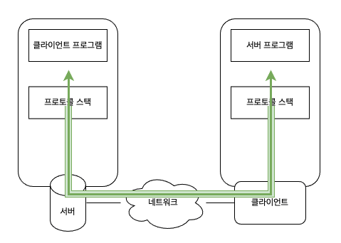

# 04. 프로토콜 스택에 메시지 송신을 의뢰한다

### 데이터 송∙수신 동작의 개요

IP 주소를 조사하고 나면 IP 주소의 상대 즉, 액세스 대상 웹 서버에 메시지를 송신하도록 OS 의 내부에 있는 프로토콜 스택에 의뢰한다.

OS 내부의 프로토콜 스택에 메시지 송신 동작을 의뢰할 때는 Socket 라이브러리 프로그램 부품을 결정된 순번대로 호출한다.

데이터를 송∙수신하는 컴퓨터 사이에 데이터의 통로(파이프) 같은 것이 있고, 이것을 통해 데이터가 흐르면서 상대측에 도착한다.

사실은 송∙수신 동작을 하기 전에 송∙수신하는 양자 사이를 파이프로 연결하는 동작이 필요하다.  
이 부분의 요점은 파이프의 양끝에 있는 데이터의 출입구이다.  
이 출입구를 소켓이라고 부르는데, 우선 이 소켓을 만들고 연결한다.

실제로는 먼저 서버측에서 소켓을 만들고, 소켓에 클라이언트가 파이프를 연결하기를 기다린다.  
구체적으로는 클라이언트측에도 소켓을 만들고, 소켓에서 파이프를 늘려 서버측의 소켓에 연결하는 것이다.

데이터를 전부 보내고 나면 연결했던 파이프가 분리된다.  
파이프를 분리할 때는 어느 쪽에서 분리해도 상관없다.

1. 소켓 생성 (소켓 작성 단계)
2. 서버측의 소켓에 파이프 연결 (접속 단계)
3. 데이터를 송∙수신 (송∙수신 단계)
4. 파이프를 분리하고 소켓을 말소 (연결 끊기 단계)

위 네 가지 동작을 실행하는 것은 OS 내부의 프로토콜 스택이다.

### 소켓의 작성 단계

클라이언트측의 소켓을 만드는 것은 간단하다. 소켓 라이브러리의 socket 이라는 프로그램 부품만 호출하면 된다.  

socket 을 호출한 후의 동작은 resolver 를 호출했을 때와 같이 socket 내부에 제어가 넘어가서 소켓을 만드는 동작을 실행하고, 이것이 끝나면 애플리케이션에 제어가 돌아온다.

소켓이 생기면 디스크립터라는 것이 돌아오며 애플리케이션은 이것을 받아서 메모리에 기록한다. 디스크립터는 소켓을 식별하기 위해 사용하는 것이다.

브라우저가 웹 서버에 액세스하는 동작에만 착안하면 알아차리지 못할 수도 있지만, 컴퓨터의 내부에서는 복수의 데이터 송∙수신 동작이 동시에 진행되는 경우가 있다.  
예를 들어 2개의 데이터 송∙수신 동작이 동시에 진행되면 2개의 소켓을 만들어야 한다. 즉, 복수의 소켓이 한 대의 컴퓨터에 존재할 수 있다는 것이다.

이런 복수개의 소켓을 하나하나 식별해야 하는데, 이것이 디스크립터이다.  
즉, 하나하나의 소켓에 할당한 번호와 같은 것이 디스크립터라고 생각하면 된다.