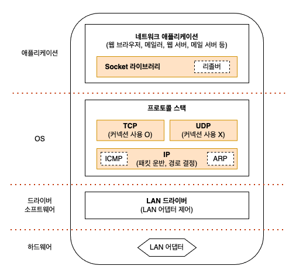

# 01. 소켓을 작성한다

### 프로톸로 스택의 내부 구성

프로토콜 스택의 내부는 역할이 서로 다른 몇 부분으로 나뉘어져 있다.

- TCP/UDP: 데이터 송∙수신을 담당
- IP: 패킷 송∙수신 동작 제어
- ICMP: 패킷을 운반할 때 발생하는 오류를 통지하거나 제어용 메시지를 통지할 때
- ARP: IP 주소에 대응하는 이더넷의 MAC 주소를 조사할 때 사용

### 소켓의 실체는 통신 제어용 제어 정보

프로토콜 스택은 내부에 제어 정보를 기록하는 메모리 영역을 가지고 있으며, 여기에 통신 동작을 제어하기 위한 제어 정보를 기록한다.  
대표적인 정보는 통신 상대의 IP 주소는 무엇인가, 포트 번호는 몇 번인가, 통신 동작이 어떤 진행 상태에 있는가 하는 것이다.

본래 소켓은 개념적인 것이어서 실체가 없으므로 굳이 말하자면 이 제어 정보 또는 제어 정보를 기록한 메모리 영역이 소켓의 실체라고 할 수 있다.  
프로토콜 스택은 이 제어 정보를 참조하면서 동작한다.

### Socket 을 호출했을 때의 동작

애플리케이션이 `socket` 을 호출하여 소켓을 만들 것을 의뢰하면 프로토콜 스택은 의뢰에 따라 한 개의 소켓을 만든다.  
이때 프로토콜 스택이 최초로 하는 일은 소켓 한 개 분량의 메모리 영역을 확보하는 것이다.  

소켓의 제어 정보를 기록하는 메모리 영역은 처음부터 존재하는 것이 아니므로 먼저 그것을 확보해 두어야 한다.  
소켓은 작성된 직후라서 아직 송∙수신 동작이 시작되지 않은 초기 상태이므로 초기 상태임을 나타내는 제어 정보를 소켓의 메모리 영역에 기록하는데, 이 과정을 통해 소켓이 만들어진다.

소켓이 만들어지면 소켓을 나타내는 디스크립터를 애플리케이션에 알려준다.  
디스크립터는 프로토콜 스택의 내부에 있는 다수의 소켓 중 어느 것을 가리키는지를 나타내는 번호표와 같은 정보이다.

디스크립터를 받은 애플리케이션은 이후 프로토콜 스택에 데이터 송∙수신 동작을 의뢰할 때 디스크립터를 통지한다.  
소켓에는 누구와 누가 통신하고 있는지, 그리고 그것이 어떤 상태로 있는지 등의 정보가 전부 기록되어 있으므로 디스크립터가 어느 소켓인지를 나타내면 필요한 정보는 전부 프로토콜 스택쪽에서 알 수 있기 때문이다.  
이렇게 해서 통신 상대의 정보를 애플리케이션에서 일일이 통지받을 필요가 없어진다.