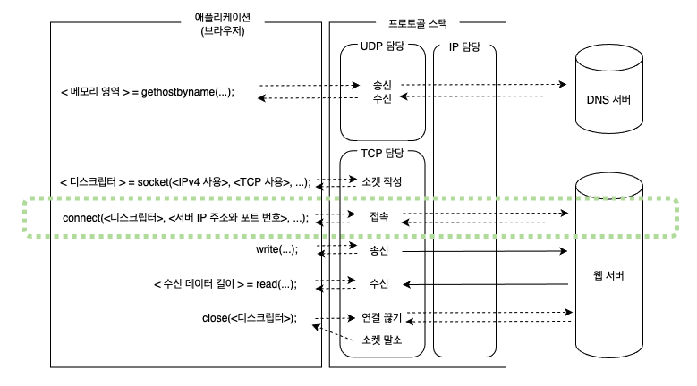

# 02. 서버에 접속한다

### 접속의 의미

소켓을 만든 직후에는 아직 아무것도 기록되어 있지 않으므로 통신 상대가 누구인지 모른다.  
이 상태에서는 송신 의뢰가 와도 데이터를 어디로 보내면 좋을지 알 수 없다.  
`socket` 을 호출하여 소켓을 만드는 동작만으로는 프로토콜 스택에는 아무것도 전달되지 않기 때문이다.  
그러므로 서버의 IP 주소나 포트 번호를 프로토콜 스택에 알리는 동작이 필요한데, 이것이 접속 동작의 한 가지 역할이다.

서버에서도 소켓이 만들어졌지만 서버의 프로톸로 스택도 클라이언트과 마찬가지로 소켓을 만드는 동작만으로는 통신 상대를 알 수 없다.  
클라이언트에서 IP 주소와 포트 번호의 정보를 알려서 통신하려는 클라이언트가 있다는 것을 서버에 전달한다.  
그러면 서버의 프로토콜 스택도 클라이언트의 정보를 가질 수 있다.  
이와 같이 클라이언트에서 서버에 통신 동작의 개시를 전달하는 것도 접속 동작의 역할 중 하나이다.

접속 동작의 첫 번째 동작은 통신 상대와의 사이에 제어 정보를 주고받아 소켓에 필요한 정보를 기록하고 데이터 송∙수신이 가능한 상태로 만드는 것이다.  
여기에서 나온 클라이언트의 IP 주소나 포트 번호를 서버에 알리는 것이 제어 정보 주고받기의 구체적인 예이다.  
제어 정보는 데이터 송∙수신 동작을 제어하기 위한 정보이며, IP 주소나 포트 번호는 대표적인 것 중의 하나이다.  
접속 동작에서 주고받는 제어 정보는 통신의 규칙으로 정해져 있으므로 규칙에 따라 접속 동작을 실행하면 필요한 정보가 전달되고 데이터를 송∙수신할 수 있는 상태가 된다.

데이터 송∙수신 동작을 실행할 때는 송∙수신하는 데이터를 일시적으로 저장하는 메모리 영역이 필요하다.  
이 메모리 영역을 '버퍼 메모리' 라고 부른다.  
버퍼 메모리의 확보도 접속 동작을 할 때 실행되는데, 이것이 '접속' 한다는 동작의 의미이다.

### 맨 앞부분에 제어 정보를 기록한 헤더를 배치한다

제어 정보에는 크게 나누어 두 종류가 있다.

하나는 클라이언트와 서버가 서로 연락을 절충하기 위해 주고받는 제어 정보이다.  
접속 동작뿐만 아니라 데이터를 송∙수신하는 동작이나 연결을 끊는 동작도 포함하여 통신 동작 전체에서 어떤 정보가 필요한지 검토하여 해당 항목들을 TCP 프로토콜의 사양으로 규정하고 있다.

이 항목들은 고정화되어 있기 때문에 접속, 송∙수신, 연결 끊기의 각 단계에서 클라이언트와 서버가 패킷을 주고받을 때마다 패킷의 맨 앞부분에 이 제어 정보를 부가한다.  
접속 동작의 단계에서는 아직 데이터 송∙수신이 이루어지지 않으므로 데이터는 없고 패킷의 내용은 제어 정보만으로 이루어져 있다.  
이 제어 정보를 패킷의 맨 앞부분에 배치하는 곳부터 헤더라고 부른다.  
또한 이더넷이나 IP 에도 같은 제어 정보가 있고, 이것도 헤더라고 부른다.

클라이언트와 서버는 이 헤더에 필요한 정보를 기록하여 연락을 취하면서 통신 동작을 진행한다.

제어 정보는 소켓에 기록하며 프로토콜 스택의 동작을 제어하기 위한 정보가 더 있다.  
애플리케이션에서 통지된 정보, 통신 상대로부터 받은 정보 등이 수시로 기록된다.

소켓에 기록한 제어 정보는 상대측에서 볼 수 없다.  
규칙에 따라 헤더에 제어 정보를 기록하여 대화하면, 그것으로 클라이언트와 서버가 서로 연락을 취하기 때문이다.  
예를 들어 내부 구조가 다른 윈도우와 리눅스는 프로토콜 스택을 만드는 방법이 설 ㅗ다르므로 필요한 제어 정보도 다를 것이다.  
하지만 양자가 문제 없이 통신할 수 있다.

소켓에 기록하는 제어 정보는 프로토콜 스택을 만드는 사람에 따라 다르지만 소켓의 제어 정보 중에서 중요한 것은 커맨드에 의해 표시할 수 있는데, 이 정보들은 어느 OS 의 프로토콜 스택에도 공통이다.  
이렇게 중요한 정보를 알면 프로토콜 스택의 움직임을 이해할 수 있을 것이다.

### 접속 동작의 실제



```
connect(<디스크립터>, <서버 IP 주소와 포트 번호>, ...)
```

서버의 IP 주소와 포트 번호를 쓰면 명령이 프로토콜 스택의 TCP 담당 부분에 전달된다.  
TCP 담당 부분은 IP 주소로 표시된 서버의 TCP 담당 부분과의 사이에 제어 정보를 주고 받는다.  
다음과 같은 단계를 밟는다.

먼저 데이터 송∙수신 동작의 개시를 나타내는 제어 정보를 기록한 헤더를 만든다.  
중요한 것은 송신처와 수신처의 포트 번호이다.  
접속해야 하는 소켓이 어느 것인지 확실히 하고 컨트롤 비트인 SYN 이라는 비트를 1로 만든다.  
이렇게 해서 TCP 헤더를 만들고 IP 담당 부분에 전달하여 송신하도록 의뢰한다.

IP 담당 부분이 패킷 송신 동작을 실행하고 네트워크를 통해 패킷이 서버에 도착하면 서버의 IP 담당 부분이 이것을 받아 TCP 담당 부분에 건네준다.  
서버의 TCP 담당 부분이 TCP 헤더를 조사하여 기록되어 있는 수신처 포트 번호에 해당하는 소켓을 찾아낸다.  
접속을 기다리는 상태에 있는 소켓 중에서 TCP 헤더의 수신처 포트 번호와 같은 번호가 기록된 것이 해당하는 소켓이다.  
해당하는 소켓이 발견되면 여기에 필요한 정보를 기록하고 접속 동작이 진행중이라는 상태가 된다.  
이 과정이 끝나면 서버의 TCP 담당 부분은 응답을 돌려보낸다.

클라이언트와 마찬가지로 송신처와 수신처의 포트 번호나 SYN 비트 등을 설정한 TCP 헤더를 만든다.  
그리고 응답을 돌려보낼 때 ACK 라는 컨트롤 비트도 1로 만든다. 이것은 패킷을 받은 것을 알리기 위한 동작이다.  
TCP 헤더를 IP 담당 부분에 건네주어 클라이언트에 반송하도록 의뢰한다.

패킷이 클라이언트에 돌아오고 IP 담당 부분을 경유하여 TCP 담당 부분에 도착한다.  
이때 TCP 헤더를 조사하여 서버의 접속 동작이 성공했는지 확인하다.  
SYN 이 1이면 접속 성공이므로 소켓에 서버의 IP 주소나 포트 번호 등과 함께 소켓에 접속 완료를 나타내는 제어 정보를 기록한다.  
그리고 서버에서 응답을 돌려보낼 때 ACK 비트를 1로 만들었는데, 이것과 같이 패킷이 도착한 것을 서버에 알리기 위해 ACK 비트를 1로 만든 TCP 헤더를 반송한다.  
이것이 서버에 도착하면 접속 동작의 대화가 끝난다.

이로써 소켓은 데이터를 송∙수신할 수 있는 상태가 된다.  
이때 파이프와 같은 것으로 소켓이 연결되었다고 생각할 수 있다.  
실제로는 무언가로 연결되어 있지 않지만, 이 파이프 같은 것을 **커넥션**이라고 한다.

커넥션은 데이터 송∙수신 동작을 계속하는 동안, 즉 close 를 호출하여 연결을 끊을 때까지 계속 존재한다.  
커넥션이 이루어지면 프로토콜 스택의 접속 동작이 끝나므로 connect 의 실행이 끝나면서 애플리케이션을 제어할 수 있게 된다.