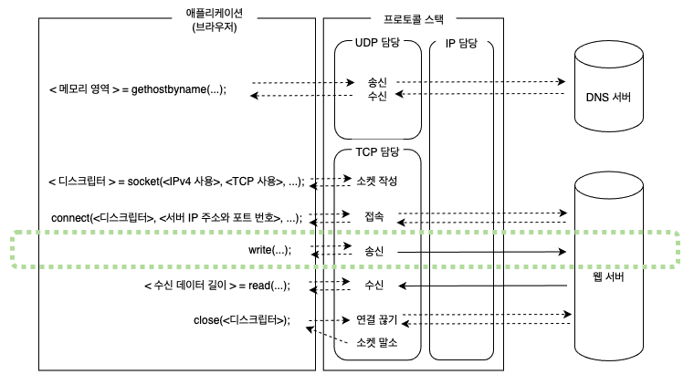
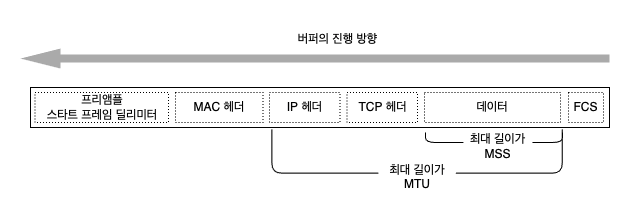
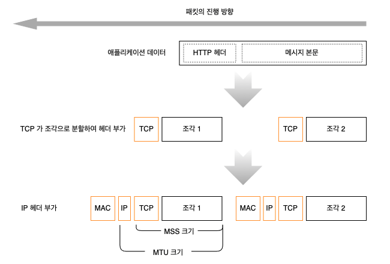
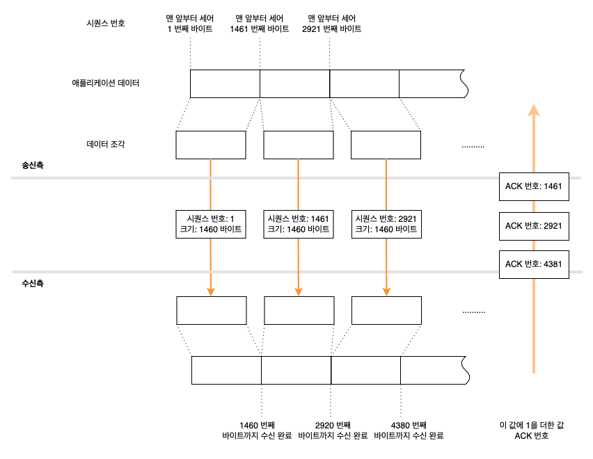
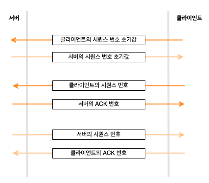
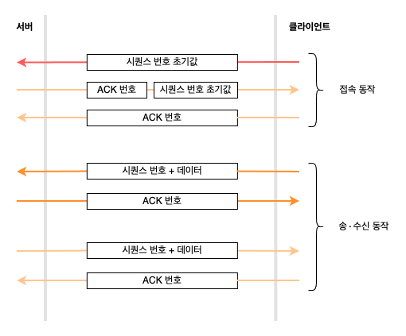

# 03. 데이터를 송∙수신한다

### 프로토콜 스택에 HTTP 리퀘스트 메시지를 넘긴다

애플리케이션이 `write` 를 호출하여 송신 데이터를 프로토콜 스택에 건네주는 곳부터 시작된다.

프로토콜 스택은 받은 데이터의 내용을 알지 못한다.  
`write` 를 호출할 때 송신 데이터의 길이를 지정하지만, 프로토콜 스택은 해당 길이만큼만 바이너리 데이터가 1 바이트씩 차례로 나열되어 있다고 인식할 뿐이다.

받은 데이터를 곧바로 송신하지 않고, 내부 송신용 버퍼 메모리 영역에 저장하고, 애플리케이션이 다음 데이터를 건네주기를 기다린다.  
송신을 의뢰할 때 애플리케이션에서 프로토콜 스택에 건네주는 데이터의 길이는 애플리케이션의 종류나 만드는 방법에 따라 결정된다.  
따라서 데이터를 곧바로 보내는 방법이라면 작은 패킷을 많이 보낼 수도 있다. 그러면 네트워크의 이용 효율이 저하되므로 어느 정도 데이터를 저장하고 나서 송∙수신 동작을 한다.

어느 정도까지 저장한 후 송신 동작을 할 때는 OS 의 종류나 버전에 따라 달라지며 다음과 같은 요소를 바탕으로 판단한다.  

> MTU: Maximum Transmission Unit  
> ㄴ 한 패킷으로 운반할 수 있는 디지털 페이지의 최대 길이 / 헤더 포함  
> MSS: Maximum Segment Size  
> ㄴ MTU 에서 헤더를 제외한 하나의 패킷으로 운반할 수 있는 데이터의 최대 길이

애플리케이션에서 받은 데이터가 MSS 를 초과하거나 MSS 에 가까운 길이에 이르기까지 데이터를 저장하고 송신 동작을 하면 패킷이 잘게 나누어질 거정을 할 필요가 없다.

애플리케이션에서 송신의 타이밍을 제어하는 옵션도 존재한다.  
'버퍼에 머물지 않고 바로 송신할 것' 이라고 지정하면 프로토콜 스택은 버퍼에 머물지 않고 송신 동작을 실행한다.  
브라우저와 같이 대화형 애플리케이션이 서버에 메시지를 보낼 때는 버퍼에 머무는 부분만큼 응답 시간이 지연되므로 이 옵션을 사용하는 경우가 많다.

### 데이터가 클 때는 분할하여 보낸다

송신 버퍼에 들어있는 데이터를 맨 앞부터 차례대로 크기에 맞게 분할하고, 분할한 조각을 한 개씩 패킷에 넣어 송신한다.  
송신 버퍼에 저장한 데이터 조각의 모습을 가늠하여 데이터 조각을 송신하면 맨 앞부분에 TCP 헤더를 부가한다.  
그리고 소켓에 기록되어 있는 제어 정보를 바탕으로 송신처 포트 번호나 수신처 포트 번호 등 필요한 항목을 기록하고, IP 담당 부분에 건네주어 송신 동작을 실행한다.

### ACK 번호를 사용하여 패킷이 도착했는지 확인한다

TCP 에는 송신한 패킷이 상대에게 올바르게 도착했는지 확인한다.  
도착하지 않았으면 다시 송신하는 기능이 있기 때문에 패킷을 송신한 후에는 확인 동작으로 넘어간다.

TCP 담당 부분은 데이터를 조각으로 분할할 때 조각이 통신 개시부터 따져서 몇 번째 바이트에 해당하는지를 세어둔다.  
데이터의 조각을 송식할 때 세어둔 값을 TCP 헤더에 기록하며, 이것이 시퀀스 번호라는 항목이다.

수신측에서는 시퀀스 번호를 이용하여 패킷이 누락되었는지 확인할 수 있다.  
예를 들어 1460 번째 바이트까지 수신 완료한 상태에서 시퀀스 번호가 1461 인 패킷이 도착하면 누락이 없다는 것을 알 수 있고,  
시퀀스 번호 1461 인 패킷이 도착하지 않았는데 시퀀스 번호가 2921 인 패킷이 도착하면 누락된 것을 알 수 있다.  

누락이 없는 것을 확인하면 수신측은 그 이전에 수신한 데이터와 합쳐서 데이터를 몇 번째 바이트까지 수신한 것인지 계산하고, 그 값을 TCP 헤더의 `ACK` 번호에 기록하여 송신측에 알려준다.  
`ACK` 번호를 되돌려주는 동작을 수신 확인 응답이라고 부르며, 송신측은 이것을 통해 상대가 어디까지 수신했는지를 파악한다.

실제로 시퀀스 번호는 1 부터 시작하지 않고 난수를 바탕으로 산출한 초기값으로 시작한다.  
1 부터 시작한다고 예측할 수 있다면 악의적인 공격을 할 우려가 있기 때문이다.

난수로 초기값을 결정하면 몇 번이 초기값인지 알 수 없기 때문에 데이터의 송∙수신을 시작하기 전에 초기값을 상대에게 알리게 되어 있다.  
접속 동작 부분에서 `SYN` 이라는 제어 비트를 1 로 하여 서버에 보내는데, 이것이 초기값을 통지하는 것을 나타낸다.

지금까지는 데이터의 흐름을 한 개만 고려하였다.  
TCP 의 데이터 송∙수신 동작은 양방향이므로 클라이언트에서 서버로 향하는 데이터의 흐름과 서버에서 클라이언트로 향하는 두 가지의 데이터 흐름이 있기 때문에 여기에 대응해야 한다.

이제까지 개념에 대해서 알아보았다.  
실제 움직임은 어떨까?

이 구조는 매우 강력하다.  
수신측에 패킷이 올바르게 도착한 것을 확인하고, 도착하지 않으면 다시 보내므로 네트워크의 어디에서 오류가 발생했더라도 그것을 전부 검출하여 회복 처리(패킷을 다시 보내는 것)를 취할 수 있다.  
반대로 말하면 구조가 이렇기 때문에 다른 곳에서 오류를 회복 조치할 필요가 없다.

이 대문에 TCP 에 맡겨두면 오류가 발생해도 데이터가 문제 없이 상대에게 도착하므로 애플리케이션의 송신 동작은 송신한 채로 끝난다.  
단 도중에 케이블이 분리되거나 서버가 다운되는 등의 이유로 TCP 가 아무리 다시 보내도 데이터가 도착하지 않는 경우가 있다.  
이때 한없이 다시 보내면 곤란하므로 TCP 는 몇 번 다시 보낸 후 회복 가능성이 없는 것으로 보고 데이터 송신 동작을 강제로 종료하고 애플리케이션에 오류를 통지한다.