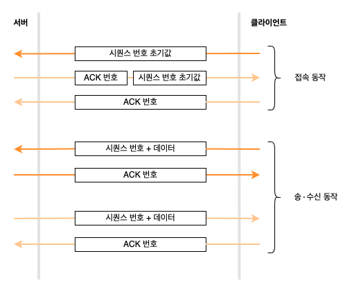

# 03. 데이터를 송∙수신한다

### 프로토콜 스택에 HTTP 리퀘스트 메시지를 넘긴다

애플리케이션이 `write` 를 호출하여 송신 데이터를 프로토콜 스택에 건네주는 곳부터 시작된다.

프로토콜 스택은 받은 데이터의 내용을 알지 못한다.  
`write` 를 호출할 때 송신 데이터의 길이를 지정하지만, 프로토콜 스택은 해당 길이만큼만 바이너리 데이터가 1 바이트씩 차례로 나열되어 있다고 인식할 뿐이다.

받은 데이터를 곧바로 송신하지 않고, 내부 송신용 버퍼 메모리 영역에 저장하고, 애플리케이션이 다음 데이터를 건네주기를 기다린다.  
송신을 의뢰할 때 애플리케이션에서 프로토콜 스택에 건네주는 데이터의 길이는 애플리케이션의 종류나 만드는 방법에 따라 결정된다.  
따라서 데이터를 곧바로 보내는 방법이라면 작은 패킷을 많이 보낼 수도 있다. 그러면 네트워크의 이용 효율이 저하되므로 어느 정도 데이터를 저장하고 나서 송∙수신 동작을 한다.

어느 정도까지 저장한 후 송신 동작을 할 때는 OS 의 종류나 버전에 따라 달라지며 다음과 같은 요소를 바탕으로 판단한다.  

> MTU: Maximum Transmission Unit  
> ㄴ 한 패킷으로 운반할 수 있는 디지털 페이지의 최대 길이 / 헤더 포함  
> MSS: Maximum Segment Size  
> ㄴ MTU 에서 헤더를 제외한 하나의 패킷으로 운반할 수 있는 데이터의 최대 길이

애플리케이션에서 받은 데이터가 MSS 를 초과하거나 MSS 에 가까운 길이에 이르기까지 데이터를 저장하고 송신 동작을 하면 패킷이 잘게 나누어질 걱정을 할 필요가 없다.

애플리케이션에서 송신의 타이밍을 제어하는 옵션도 존재한다.  
'버퍼에 머물지 않고 바로 송신할 것' 이라고 지정하면 프로토콜 스택은 버퍼에 머물지 않고 송신 동작을 실행한다.  
브라우저와 같이 대화형 애플리케이션이 서버에 메시지를 보낼 때는 버퍼에 머무는 부분만큼 응답 시간이 지연되므로 이 옵션을 사용하는 경우가 많다.

### 데이터가 클 때는 분할하여 보낸다

송신 버퍼에 들어있는 데이터를 맨 앞부터 차례대로 크기에 맞게 분할하고, 분할한 조각을 한 개씩 패킷에 넣어 송신한다.  
송신 버퍼에 저장한 데이터 조각의 모습을 가늠하여 데이터 조각을 송신하면 맨 앞부분에 TCP 헤더를 부가한다.  
그리고 소켓에 기록되어 있는 제어 정보를 바탕으로 송신처 포트 번호나 수신처 포트 번호 등 필요한 항목을 기록하고, IP 담당 부분에 건네주어 송신 동작을 실행한다.

### ACK 번호를 사용하여 패킷이 도착했는지 확인한다

TCP 에는 송신한 패킷이 상대에게 올바르게 도착했는지 확인한다.  
도착하지 않았으면 다시 송신하는 기능이 있기 때문에 패킷을 송신한 후에는 확인 동작으로 넘어간다.

TCP 담당 부분은 데이터를 조각으로 분할할 때 조각이 통신 개시부터 따져서 몇 번째 바이트에 해당하는지를 세어둔다.  
데이터의 조각을 송식할 때 세어둔 값을 TCP 헤더에 기록하며, 이것이 시퀀스 번호라는 항목이다.

수신측에서는 시퀀스 번호를 이용하여 패킷이 누락되었는지 확인할 수 있다.  
예를 들어 1460 번째 바이트까지 수신 완료한 상태에서 시퀀스 번호가 1461 인 패킷이 도착하면 누락이 없다는 것을 알 수 있고,  
시퀀스 번호 1461 인 패킷이 도착하지 않았는데 시퀀스 번호가 2921 인 패킷이 도착하면 누락된 것을 알 수 있다.  

누락이 없는 것을 확인하면 수신측은 그 이전에 수신한 데이터와 합쳐서 데이터를 몇 번째 바이트까지 수신한 것인지 계산하고, 그 값을 TCP 헤더의 `ACK` 번호에 기록하여 송신측에 알려준다.  
`ACK` 번호를 되돌려주는 동작을 수신 확인 응답이라고 부르며, 송신측은 이것을 통해 상대가 어디까지 수신했는지를 파악한다.

실제로 시퀀스 번호는 1 부터 시작하지 않고 난수를 바탕으로 산출한 초기값으로 시작한다.  
1 부터 시작한다고 예측할 수 있다면 악의적인 공격을 할 우려가 있기 때문이다.

난수로 초기값을 결정하면 몇 번이 초기값인지 알 수 없기 때문에 데이터의 송∙수신을 시작하기 전에 초기값을 상대에게 알리게 되어 있다.  
접속 동작 부분에서 `SYN` 이라는 제어 비트를 1 로 하여 서버에 보내는데, 이것이 초기값을 통지하는 것을 나타낸다.

지금까지는 데이터의 흐름을 한 개만 고려하였다.  
TCP 의 데이터 송∙수신 동작은 양방향이므로 클라이언트에서 서버로 향하는 데이터의 흐름과 서버에서 클라이언트로 향하는 두 가지의 데이터 흐름이 있기 때문에 여기에 대응해야 한다.

이제까지 개념에 대해서 알아보았다.  
실제 움직임은 어떨까?

이 구조는 매우 강력하다.  
수신측에 패킷이 올바르게 도착한 것을 확인하고, 도착하지 않으면 다시 보내므로 네트워크의 어디에서 오류가 발생했더라도 그것을 전부 검출하여 회복 처리(패킷을 다시 보내는 것)를 취할 수 있다.  
반대로 말하면 구조가 이렇기 때문에 다른 곳에서 오류를 회복 조치할 필요가 없다.

이 때문에 TCP 에 맡겨두면 오류가 발생해도 데이터가 문제 없이 상대에게 도착하므로 애플리케이션의 송신 동작은 송신한 채로 끝난다.  
단 도중에 케이블이 분리되거나 서버가 다운되는 등의 이유로 TCP 가 아무리 다시 보내도 데이터가 도착하지 않는 경우가 있다.  
이때 한없이 다시 보내면 곤란하므로 TCP 는 몇 번 다시 보낸 후 회복 가능성이 없는 것으로 보고 데이터 송신 동작을 강제로 종료하고 애플리케이션에 오류를 통지한다.

### 패킷 평균 왕복 시간으로 ACK 번호의 대기 시간을 조정한다

실제 오류 검출과 회복의 원리는 꽤 복잡하기 때문에 요점이 되는 부분만 정리해보자.  
먼저 `ACK` 번호가 돌아오는 것을 기다리는 시간인데, 이 대기 시간을 **타임아웃 값**이라고 한다.

네트워크가 혼잡하여 정체가 일어나면 `ACK` 번호가 돌아오는 것이 지연되므로 대기 시간을 어느 정도 길게 설정해야 한다.  
대기 시간을 너무 짧게 잡으면 `ACK` 번호가 돌아오기 전에 다시 보내서 혼잡을 악화시킬 수 있다.  
그렇다고 대기 시간을 너무 길게 잡으면 패킷을 다시 보내는 동작이 지연되어 속도 저하의 원인이 되기도 한다.

서버와의 거리, 정체시의 지연 등등 여러 이유로 인해 대기 시간을 결정하는게 쉽지 않다.  
또 이런 이유들로 대기 시간 설정의 범위가 크다면 대기 시간을 읽정한 값으로 설정하는 방법은 적절하지 않다.  
그래서 TCP 는 대기 시간을 동적으로 변경하는 방법을 취한다.   
`ACK` 번호가 돌아오는 시간을 기준으로 대기 시간을 판단하는 것이다.

데이터 송신 동작을 실행하고 있을 때 항상 `ACK` 번호가 돌아오는 시간을 계측해둔다.  
그리고 `ACK` 번호가 돌아오는 시간이 지연되면 이것에 대응하여 대기 시간도 늘린다. 
반대로 `ACK` 번호가 곧바로 돌아오면 대기 시간을 짧게 설정한다.

### 윈도우 제어 방식으로 효율적으로 ACK 번호를 관리한다.

한 개의 패킷을 보내고 `ACK` 번호를 기다리는 방법은 단순하고 이해하기 쉽지만, `ACK` 번호가 돌아올 때까지의 시간 동안 아무 일도 하지 ㅇ낳고 기다리는 것은 시간 낭비이다.  
이런 낭비를 줄이기 위해 TCP 는 윈도우 제어라는 방식에 따라 송신과 `ACK` 번호 통지의 동작을 실행한다.

윈도우 제어는 한 개의 패킷을 보낸 후 `ACK` 번호를 기다리지 않고 차례대로 연속해서 복수의 패킷을 보내는 방법이다.  
그러면 `ACK` 번호가 돌아올 때까지의 시간이 낭비되지 않는다.

그러나 `ACK` 번호를 기다리지 않고 차례로 패킷을 보내면 수신측의 능력을 초과하여 패킷을 보내는 문제가 발생할 수 있다.

수신측의 TCP 는 패킷을 수신하면 일단 수신용 버퍼 메모리에 데이터를 일시 보관한다.  
수신측에서는 `ACK` 번호를 계산하거나 조각을 연결하여 원래 데이터를 복원한 후 애플리케이션에 건네주는데, 처리가 끝나지 않은 상태에서 다음 패킷이 도착해도 문제 없도록 수신 버퍼를 설치하고, 여기에 수신된 데이터를 일시 보관하는 것이다.

하지만 애플리케이션에 건네주는 속도보다 빠른 속도로 많은 패킷이 도착하면 수신 버퍼가 넘치고, 넘쳐서 보관하지 못하는 패킷들은 잘 도착했었어도 오류가 발생한 것처럼 되는데,
이것은 수신측의 능력을 초과한다는 것을 의미한다.

해결 방법은 먼저 수신측에서 송신측에 수신 가능한 데이터 양을 알려주고, 송신측은 이 양을 초과하지 않도록 송신 동작을 실행하는데, 이것이 윈도우 제어 방식의 개념이다.

수신측은 수신 버퍼에 데이터를 임시 보관하고 수신 처리를 진행한다.  
수신 처리가 끝나고 수신 버퍼에 빈 부분이 생기면 그 분량만큼 수신할 수 있는 데이터 양이 늘어나므로 TCP 헤더의 **윈도우 필드**에서 이것을 송신측에 알린다.  
이렇게 해서 수신측의 능력을 초과하여 데이터를 보내는 일이 없어진다.

수신 가능한 데이터 양의 최대값을 **윈도우 사이즈**라고 부른다.

### ACK 번호와 윈도우를 합승한다

윈도우 통지 동작은 수신측이 수신 버퍼에서 데이터를 추출하여 애플리케이션에 건네주었을 때이다.  
이 동작은 수신측의 애플리케이션에서 보낸 의뢰가 계기가 되므로 언제 일어날지 송신측에서는 알 수 없다.  
그러므로 수신측에서 애플리케이션에 데이터를 건네주고 수신 버퍼의 빈 영역이 늘어났을 때 이것을 송신측에 통지해야 하는데, 이것이 윈도우 통지의 타이밍이다.

`ACK` 번호는 수신측에서 데이터를 받았을 때 정상 수신을 확인할 수 있는 경우에만 송신측에 보낸다.  
즉, 데이터를 수신한 후 즉시 보낸다고 할 수 있다.

수신측은 `ACK` 번호나 윈도우를 통지할 때 소켓을 바로 보내지 않고 잠시 기다린다.  
기다리는 사이에 다음 통지 동작이 일어나면 양쪽을 상승시켜서 한 개의 패킷으로 묶어서 보낸다.

### HTTP 응답 메시지를 수신한다

브라우저는 요청 메시지를 송신해 달라고 의뢰하고, 이것이 끝나면 서버에서 돌아오는 응답 메시지를 받기 위해 `read` 를 호출한다.  
그러면 프로토콜 스택으로 제어가 넘어가고, 프로토콜 스택이 동작한다.

프로토콜 스택은 수신 버퍼에서 수신 데이터를 추출하여 애플리케이션에 전달한다.  

수신한 데이터 조각과 TCP 헤더의 내용을 조사하여 도중에 데이터가 누락되었는지 검사하고, 문제가 없다면 `ACK` 번호를 반송한다.  
그리고 데이터 조각을 수신 버퍼에 일시 보관하고, 조각을 연결하여 데이터를 원래 모습으로 복원한 후 애플리케이션에 전달한다.  

구체적으로는 수신 데이터를 애플리케이션이 지정한 메모리 영역에 옮겨 기록한 후 애플리케이션에 제어를 되돌려준다.  
그리고 애플리케이션에 데이터를 건네주고 나서 타이밍을 가늠하여 윈도우를 송신측에 통지한다.