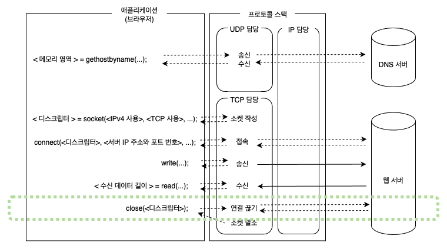
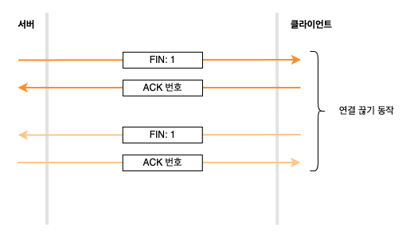
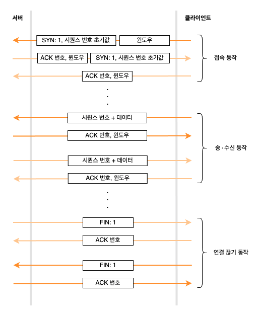

# 04. 서버에서 연결을 끊어 소켓을 말소한다

### 데이터 보내기를 완료했을 때 연결을 끊는다

데이터 송∙수신을 종료하는 것은 애플리케이션이 송신해야 하는 데이터를 전부 송신 완료했다고 판단했을 때이다.  
애플리케이션에 따라 차이가 있지만 웹이라면 브라우저에서 웹 서버에 요청 메시지를 보내고, 서버가 응답 메시지를 반송 완료하면 데이터 보내기가 완료된 것이다.  
이 경우 서버가 연결 끊기 단계에 들어간다.

서버의 애플리케이션이 먼저 Socket 라이브러리의 `close` 를 호출한다.

서버의 프로토콜 스택이 TCP 헤더를 만들고, 여기에 연결 끊기를 나타내는 정보를 설정한다.  

> 컨트롤 비트의 `FIN` 비트에 1 을 설정하고, IP 담당 부분에 의뢰하여 클라이언트에 송신해 달라고 한다.

이와 동시에 서버의 소켓에 연결 끊기 동작에 들어갔다는 정보를 기록한다.

서버에서 `FIN` 에 1 을 설정한 TCP 헤더가 클라이언트에 도착하면 클라이언트의 프로토콜 스택은 자신의 소켓에 서버가 연결 끊기 동작에 들어갔다는 것을 기록한다.  
그리고 `FIN` 을 1 로 설정한 패킷을 받은 사실을 알리기 위해 `ACK` 번호를 서버에 반송하고, 끝나면 애플리케이션이 데이터를 가지러 올 때까지 기다린다.

애플리케이션이 `read` 를 호출하여 데이터를 가지러 올 것이다.  
그러면 데이터를 건네지 않고 서버에서 보낸 데이터를 전부 수신 완료했다는 사실을 애플리케이션에게 알린다.  
웹의 동작은 서버가 응답을 반송하면 끝나도록 규칙으로 정해져 있으므로 서버에서 보낸 데이터를 전부 수신 완료하면 클라이언트도 종료한다.

클라이언트의 애플리케이션도 `close` 를 호출하여 데이터 송∙수신 동작을 끝낸다.  
클라이언트의 프로토콜 스택은 서버와 마찬가지로 `FIN` 비트에 1 을 설정한 TCP 헤더를 만들고 IP 담당 부분에 의뢰하여 서버에 송신한 후 `ACK` 번호가 돌아오면 서버와의 대화가 끝난다.

### 소켓을 말소한다

서버와의 대화가 끝나면 소켓을 사용하여 서버와 대화할 수 없게 된다.  
이때 소켓은 필요 없지만 바로 소켓을 말소하지 않고 잠시 기다린 후 말소한다.

잠시 기다리는 이유는 오동작을 막기 위함이며 오동작이 일어나는 이유는 다양하다.

### 데이터 송∙수신 동작을 정리한다

