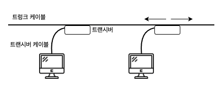
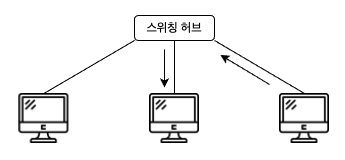
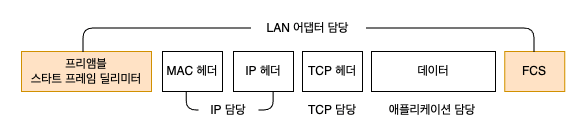

# 05. IP 와 이더넷의 패킷 송∙수신 동작 

### 패킷의 기본

먼저 송신처가 패킷을 만든다.  
그후 패킷을 가장 가까운 중계 장치에 송신한다.

패킷의 헤더에 기록되어 있는 수신처와 표에 등록된 내용을 비교하여 패킷의 목적지를 판단한다.  
이렇게 해서 다음 목적지인 중계 장치에 송신한다.  
차례로 패킷을 중계하면 최종적으로 수신처의 기기에 패킷이 도착한다.

송신처와 수신처의 기기를 묶어서 '엔드노드' 라고 부른다.

서브넷은 '라우터' 와 '허브' 라는 두 종류의 패킷 중계 장치에서 다음과 같은 역할을 분담하면서 패킷을 운반한다.
> 1. 라우터가 목적지를 확인하여 다음 라우터를 나타낸다.
> 2. 허브가 서브넷 안에서 패킷을 운반하여 다음 라우터에 도착한다.

송신처에서 패킷의 목적지가 되는 액세스 대상 서버의 IP 주소를 IP 헤더의 수신처에 기록한다.  
IP 는 수신처가 어느 방향에 있는지를 조사하고, 그 방향에 있는 다음 라우터를 조사한다.  
그리고 그곳에 도착하도록 이더넷에 의뢰한다.  
다음 라우터에 할당된 이더넷의 주소인 MAC 주소를 조사하고, MAC 헤더에 기록한다.

이더넷 부분은 다른 것으로 대체할 수 있다.  
무선 LAN, ADSL, FTTH 등 IP 의 의뢰를 받아 패킷을 운반할 수 잇는 것이면 무엇이든지 이더넷 대신 사용할 수 있다.

### 패킷 송∙수신 동작의 개요

IP 담당 부분은 패킷을 상대에게 송출만 하기 때문에 그 뒤에 상대가 있는 곳까지 패킷을 운반하는 것은 허브나 라우터 같은 네트워크 기기의 역할이 되므로 
IP 담당 부분은 패킷을 운반하는 동작 전체에서 입구 부분에 불과하다.

TCP 담당 부분은 데이터의 조각에 TCP 헤더를 부가한 것을 IP 담당 부분에 건네준다.   
IP 담당 부분은 그 앞에 제어 정보를 기록한 두 개의 헤더를 부가한다.  
> MAC 헤더: 이더넷용 헤더, MAC 주소를 쓴다.
> IP 헤더: IP 용 헤더, IP 주소를 쓴다.

IP 가 패킷을 송∙수신하는 동작은 제어 패킷이든지, 데이터의 패킷이든지 패킷의 역할에 상관 없이 모두 같다.  
TCP 헤더와 데이터 조각을 한 덩어리의 바이너리 데이터로 간주하여 내용을 보지 않고 송∙수신 동작을 실행하기 때문이다.

### 수신처 IP 주소를 기록한 IP 헤더를 만든다

IP 담당 부분은 TCP 담당 부분에서 패킷 송∙수신 의뢰를 받으면 **IP 헤더**를 만들어 TCP 의 헤더 앞에 붙인다.

#### 수신처 IP 주소
TCP 담당 부분에서 통지된 통신 상대의 IP 주소를 설정한다.  
IP 주소는 TCP 의 접속 동작을 실행할 때 애플리케이션에서 통지된 것을 TCP 담당 부분이 IP 담당 부분에게 통지하므로 본래 애플리케이션에서 통지된 통신 상대의 IP 주소이다.

#### 송신처 IP 주소
이 컴퓨터에 할당된 IP 주소를 설정한다고 생각하면 되지만, 사실 IP 주소는 LAN 어댑터에 할당되므로 LAN 어댑터에 할당된 IP 주소가 정확한 표현이다.

패킷을 건네줄 상대를 판단하는 방법은 라우터가 IP 용 표를 사용하여 다음 라우터를 결정하는 동작과 같다.  
프로토콜 스택의 IP 담당 부분과 패킷을 송∙수신하는 부분은 IP 의 규칙에 따라 패킷을 송∙수신한다는 점에서 동일하기 때문에 같은 방법을 사용한다.

#### 프로토콜 번호
패킷에 들어간 내용물이 어디에서 의뢰받은 것인지를 나타내는 값을 설정한다.  
TCP 에서 의뢰받은 내용물이라면 06(16진수 표기), UDP 에서 의뢰받은 것이면 17(16진수 표기)이라는 식이며, 값은 규칙에 결정되어 있다.

### 이더넷용 MAC 헤더를 만든다

IP 담당 부분은 IP 헤더를 붙였으면 그 앞에 MAC 헤더를 붙인다.  
MAC 헤더는 이더넷에서 사용하는 헤더로서 수신처나 송신처의 MAC 주소 등이 기록되어 있다.

이더넷은 TCP/IP 와 다른 구조로 패킷의 수신처를 판단하며, 이 구조를 따르지 않으면 이더넷 패킷을 운반할 수 없다.  
이더넷의 수신처 판단 구조로 사용하는 것이 MAC 헤더이다.

패킷을 건네줄 상대를 알았으면 상대의 MAC 주소를 수신처 MAC 주소의 필드에 설정하면 되지만, 이 점에서 상대의 MAC 주소는 모르기 때문에 IP 주소에서 MAC 주소를 조사하는 동작을 실행한다.

### ARP 로 수신처 라우터의 MAC 주소를 조사한다

이때 사용하는 것이 ARP 인데, 이더넷에는 연결되어 있는 전원에게 패킷을 전달하는 브로드캐스트라는 구조가 있다.  
이 구조를 이용하여 MAC 주소를 알아낸다.  
상대가 자신과 같은 네트워크에 존재하면 이것으로 MAC 주소를 알 수 있따.  
그러면 MAC 주소를 MAC 헤더에 설정하여 MAC 헤더를 만든다.

패킷을 보낼 때마다 이 동작을 하면 ARP 의 패킷이 불어나기 때문에 한 번 조사한 결과는 ARP 캐시라는 메모리 영역에 보존하여 다시 이용한다.

MAC 헤더를 IP 헤더의 앞에 붙이면 패킷이 완성된다.  
이렇게 패킷을 만들기까지가 IP 담당 부분의 역할이다.

### 이더넷의 기본

이더넷은 다수의 컴퓨터가 여러 상대와 자유롭게 적은 비용으로 통신하기 위해 고안된 통신 기술이다.

컴퓨터가 신호를 송신하면 케이블을 통해 네트워크 전체에 신호가 흐르고 연결된 모두에게 신호가 도착한다.  
패킷의 수신처에 해당하는 기기는 패킷을 수신하고 다른 기기는 패킷을 폐기한다.  
이 동작을 제어하기 위해 MAC 헤더를 사용한다.

현재는 다음과 같이 스위칭 허브를 사용한 형태가 보급되었다.  
이것이 현재 말하는 이더넷이다.

스위칭 허브를 사용하는 형태는 연결된 모두에게 신호가 전달되지 않고 수신처 MAC 주소로 나타내는 원하는 기기가 존재하는 부분에만 신호가 전달된다.  
그러나 수신처 MAC 주소의 상대에게 패킷이 전달된다는 점은 변하지 않았으므로 MAC 헤더의 개념은 그대로이다.

이더넷에 접속된 기기는 이더넷이라는 하나의 사양에 기초하여 동작하기 때문에 앞으로의 설명은 클라이언트 PC 뿐만 아니라 서버나 라우터를 포함한 모든 기기에 공통적으로 적용된다.  
이더넷도 IP 와 마찬가지로 패킷의 내용물은 보지 않으므로 이더넷의 송∙수신 동작은 TCP 동작 단계에 상관 없이 모든 것에 공통이다.

### IP 패킷을 전기나 빛의 신호로 변환하여 송신한다

IP 가 만든 패킷은 메모리에 기억된 디지털 데이터이므로 이것을 그대로 상대에게 보낼 수 없다.  
디지털 데이터를 전기나 빛의 신호로 변환하여 네트워크의 케이블에 송출하는데, 이것이 송∙수신 동작의 본질이라고 할 수 있다.

이 동작을 실행하는 것이 LAN 어댑터인데, LAN 어댑터를 제어하려면 LAN 드라이버 소프트웨어가 필요하다.  

LAN 어댑터는 전원을 공급하여 OS 를 시동할 때 LAN 드라이버가 하드웨어의 초기화 작업을 수행해야 사용 가능한 상태가 된다.  
초기화 작업 중 하나가 이더넷의 송∙수신 동작을 제어하는 MAC 이라는 회로에 MAC 주소를 설정하는 것이다.

### 패킷에 3개의 제어용 데이터를 추가한다

LAN 드라이버는 IP 담당 부분에서 패킷을 받으면 그것을 LAN 어댑터의 버퍼 메모리에 복사한다.  
복사를 마친 후 패킷을 송신하도록 MAC 회로에 명령을 보내면 MAC 회로의 작업이 시작된다.

MAC 회로는 송신 패킷을 버퍼 메모리에서 추출하고 맨 앞에는 프리앰블과 스타트 프레임 딜리미터라는 두 개의 데이터를, 맨 끝에는 프레임 체크 시퀀스(FCS)라는 오류 검출용 데이터를 부가한다.

### 허브를 향해 패킷을 송신한다

프리앰블, 스타트 프레임 딜리미터, FCS 의 세 가지를 부가하면 케이블에 송출하는 패킷이 완성된다.  
이제 신호를 송신하는데, 리피터 허브를 사용했을 때의 반이중 모드와 스위칭 허브를 사용한 전이중 모드 두 가지가 존재한다.

### 돌아온 패킷을 받는다

신호를 디지털 데이터로 변환하여 동작을 개시한다.  
컴퓨터 내부에서는 복수의 프로그램이 동시에 작동하고 복수의 통신 동작이 함께 진해오디고 있으므로 수신 패킷은 다른 애플리케이션의 것일 수도 있지만, 
LAN 드라이버는 이런 것에 신경쓰지 않고 타입 필드의 값에 대응하는 프로토콜 스택에 패킷을 건네주기만 한다.  
프로토콜 스택이 어느 애플리케이션에 대응하는 패킷인지 판단하여 적절한 조치를 취한다.

### 서버의 응답 패킷을 IP 에서 TCP 로 넘긴다

서버에서 반송된 패킷의 경우 LAN 드라이버는 TCP/IP 의 프로토콜 스택에 패킷을 건넨다.  
그러면 IP 담당 부분은 IP 헤더 부분부터 조사하여 이상유무를 확인하고, 수신처 IP 주소를 조사한다.  
패킷을 수신한 기기가 윈도우의 클라이언트 PC 였으면 서버에서 회신된 패킷의 수신처 IP 주소는 수신한 LAN 어댑터에 할당된 주소와 일치할 것이므로 이것을 확인하고 패킷을 수신한다.

만약 수신처 IP 주소가 자신의 주소와 다르면 오류가 있는 것이다.  
오류가 발생했을 때는 IP 담당 부분이 ICMP 라는 메시지를 사용하여 통신 상대에게 오류를 통지한다.

IP 담당 부분의 역할이 끝나면 패킷을 TCP 담당 부분에 건네준다.  
TCP 담당 부분은 IP 헤더에 기록된 수신처 IP 주소와 송신처 IP 주소, TCP 헤더에 기록된 수신처 포트 번호 및 송신처 포트 번호의 네 가지 항목을 조사하여 해당하는 소켓을 찾는다.  
해당하는 소켓을 찾아내면 통신의 진행 상태가 기록되어 있으므로 상황에 따라 적절한 동작을 실행한다.