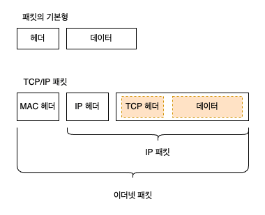
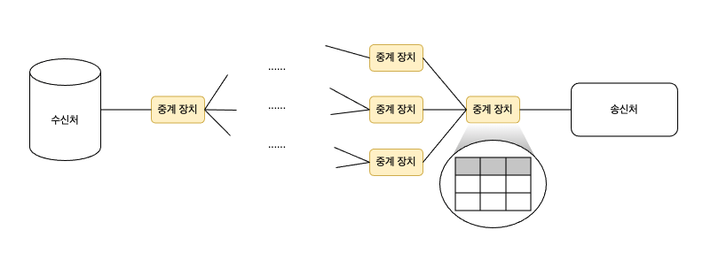
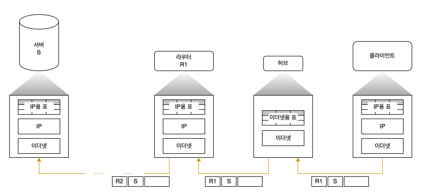
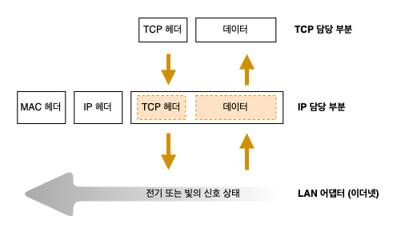

# 05. IP 와 이더넷의 패킷 송∙수신 동작 

### 패킷의 기본

먼저 송신처가 패킷을 만든다.  
그후 패킷을 가장 가까운 중계 장치에 송신한다.

패킷의 헤더에 기록되어 있는 수신처와 표에 등록된 내용을 비교하여 패킷의 목적지를 판단한다.  
이렇게 해서 다음 목적지인 중계 장치에 송신한다.  
차례로 패킷을 중계하면 최종적으로 수신처의 기기에 패킷이 도착한다.

송신처와 수신처의 기기를 묶어서 '엔드노드' 라고 부른다.

서브넷은 '라우터' 와 '허브' 라는 두 종류의 패킷 중계 장치에서 다음과 같은 역할을 분담하면서 패킷을 운반한다.
> 1. 라우터가 목적지를 확인하여 다음 라우터를 나타낸다.
> 2. 허브가 서브넷 안에서 패킷을 운반하여 다음 라우터에 도착한다.

송신처에서 패킷의 목적지가 되는 액세스 대상 서버의 IP 주소를 IP 헤더의 수신처에 기록한다.  
IP 는 수신처가 어느 방향에 있는지를 조사하고, 그 방향에 있는 다음 라우터를 조사한다.  
그리고 그곳에 도착하도록 이더넷에 의뢰한다.  
다음 라우터에 할당된 이더넷의 주소인 MAC 주소를 조사하고, MAC 헤더에 기록한다.

이더넷 부분은 다른 것으로 대체할 수 있다.  
무선 LAN, ADSL, FTTH 등 IP 의 의뢰를 받아 패킷을 운반할 수 잇는 것이면 무엇이든지 이더넷 대신 사용할 수 있다.

### 패킷 송∙수신 동작의 개요

IP 담당 부분은 패킷을 상대에게 송출만 하기 때문에 그 뒤에 상대가 있는 곳까지 패킷을 운반하는 것은 허브나 라우터 같은 네트워크 기기의 역할이 되므로 
IP 담당 부분은 패킷을 운반하는 동작 전체에서 입구 부분에 불과하다.

TCP 담당 부분은 데이터의 조각에 TCP 헤더를 부가한 것을 IP 담당 부분에 건네준다.   
IP 담당 부분은 그 앞에 제어 정보를 기록한 두 개의 헤더를 부가한다.  
> MAC 헤더: 이더넷용 헤더, MAC 주소를 쓴다.
> IP 헤더: IP 용 헤더, IP 주소를 쓴다.

IP 가 패킷을 송∙수신하는 동작은 제어 패킷이든지, 데이터의 패킷이든지 패킷의 역할에 상관 없이 모두 같다.  
TCP 헤더와 데이터 조각을 한 덩어리의 바이너리 데이터로 간주하여 내용을 보지 않고 송∙수신 동작을 실행하기 때문이다.

### 수신처 IP 주소를 기록한 IP 헤더를 만든다

IP 담당 부분은 TCP 담당 부분에서 패킷 송∙수신 의뢰를 받으면 **IP 헤더**를 만들어 TCP 의 헤더 앞에 붙인다.

#### 수신처 IP 주소
TCP 담당 부분에서 통지된 통신 상대의 IP 주소를 설정한다.  
IP 주소는 TCP 의 접속 동작을 실행할 때 애플리케이션에서 통지된 것을 TCP 담당 부분이 IP 담당 부분에게 통지하므로 본래 애플리케이션에서 통지된 통신 상대의 IP 주소이다.

#### 송신처 IP 주소
이 컴퓨터에 할당된 IP 주소를 설정한다고 생각하면 되지만, 사실 IP 주소는 LAN 어댑터에 할당되므로 LAN 어댑터에 할당된 IP 주소가 정확한 표현이다.

패킷을 건네줄 상대를 판단하는 방법은 라우터가 IP 용 표를 사용하여 다음 라우터를 결정하는 동작과 같다.  
프로토콜 스택의 IP 담당 부분과 패킷을 송∙수신하는 부분은 IP 의 규칙에 따라 패킷을 송∙수신한다는 점에서 동일하기 때문에 같은 방법을 사용한다.

#### 프로토콜 번호
패킷에 들어간 내용물이 어디에서 의뢰받은 것인지를 나타내는 값을 설정한다.  
TCP 에서 의뢰받은 내용물이라면 06(16진수 표기), UDP 에서 의뢰받은 것이면 17(16진수 표기)이라는 식이며, 값은 규칙에 결정되어 있다.

### 이더넷용 MAC 헤더를 만든다

IP 담당 부분은 IP 헤더를 붙였으면 그 앞에 MAC 헤더를 붙인다.  
MAC 헤더는 이더넷에서 사용하는 헤더로서 수신처나 송신처의 MAC 주소 등이 기록되어 있다.

이더넷은 TCP/IP 와 다른 구조로 패킷의 수신처를 판단하며, 이 구조를 따르지 않으면 이더넷 패킷을 운반할 수 없다.  
이더넷의 수신처 판단 구조로 사용하는 것이 MAC 헤더이다.

패킷을 건네줄 상대를 알았으면 상대의 MAC 주소를 수신처 MAC 주소의 필드에 설정하면 되지만, 이 점에서 상대의 MAC 주소는 모르기 때문에 IP 주소에서 MAC 주소를 조사하는 동작을 실행한다.

### ARP 로 수신처 라우터의 MAC 주소를 조사한다

이때 사용하는 것이 ARP 인데, 이더넷에는 연결되어 있는 전원에게 패킷을 전달하는 브로드캐스트라는 구조가 있다.  
이 구조를 이용하여 MAC 주소를 알아낸다.  
상대가 자신과 같은 네트워크에 존재하면 이것으로 MAC 주소를 알 수 있따.  
그러면 MAC 주소를 MAC 헤더에 설정하여 MAC 헤더를 만든다.

패킷을 보낼 때마다 이 동작을 하면 ARP 의 패킷이 불어나기 때문에 한 번 조사한 결과는 ARP 캐시라는 메모리 영역에 보존하여 다시 이용한다.

MAC 헤더를 IP 헤더의 앞에 붙이면 패킷이 완성된다.  
이렇게 패킷을 만들기까지가 IP 담당 부분의 역할이다.