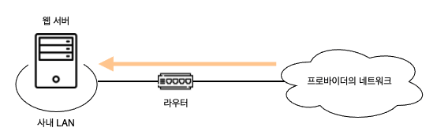
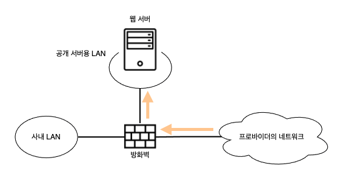
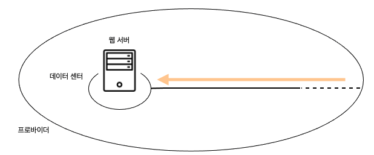

# 01. 웹 서버의 설치 장소 

### 사내에 웹 서버를 설치하는 경우

패킷이 서버에 도착하기까지 과정은 서버 설치 장소에 따라 다르다.  
가장 간단한 것은 아래와 같이 사내의 LAN 에 서버를 설치하고, 인터넷에서 직접 액세스하는 경우이다.

이전에는 이런 형태로 서버를 설치하는 경우가 많았지만, 현재는 다음과 같은 이유로 지양한다.
1. IP 주소의 부족
2. 보안상 취약

지금은 아래와 같이 **방확벽**을 두는 방법이 일반적이다.

방화벽은 관문의 역할을 하여 특정 서버에서 동작하는 특정 애플리케이션에 액세스하는 패킷만 통과시키고, 그 외의 패킷을 차단하는 역할을 한다.  
다만 방화벽을 사용한다고 위험성이 완전히 없어지는것은 아니다. 단지 위험성이 크게 낮아진 것이다.

### 데이터센터에 웹 서버를 설치하는 경우

웹 서버는 회사 안에만 설치하는 것이 아니다.

프로바이더 등이 운영하는 데이터센터라는 시설에 서버를 가지고 들어가서 설치하거나 프로바이더가 소유하는 서버를 빌려쓰는 형태로 운영하는 경우도 있다.