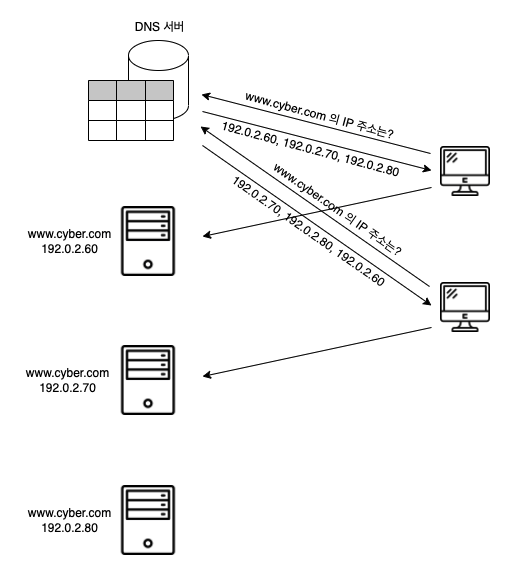
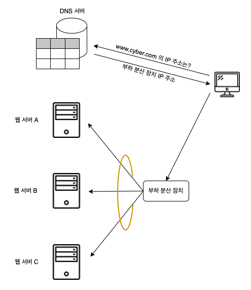

# 03. 복수 서버에 리퀘스트를 분배한 서버의 부하 분산 

### 처리 능력이 부족하면 복수 서버로 부하 분산된다

서버에 액세스가 증가할 때는 서버로 통하는 회선을 빠르게 하면 된다.  
그러나 서버의 처리 능력이 좋지 못하면 회선의 속도를 따라잡지 못할 수 있다.

그렇다면 서버를 고성능 기종으로 교체하면 된다.  
하지만 이 역시도 한 대로는 따라잡지 못할 수 있다.

이때는 복수의 서버를 사용하여 처리를 분담하는 방법으로 서버 한 대당 처리량을 줄이는 것이 효과적이다.  
이러한 처리 방법을 통틀어 **분산 처리**라고 하는데, 처리를 분담하는 방식은 여러 가지이다.

가장 간단한 방법은 단순히 여러 대의 웹 서버를 설치하고 한 대가 담당하는 사용자 수를 줄이는 방법이다.  
이때 클라이언트가 보내는 요청을 웹 서버에 분배하는 구조가 필요하다.  

분배하는 여러 방법 중, DNS 서버에서 분배하는 방법이 가장 간단하다.

#### 라운드 로빈
서버에 액세스할 때 DNS 서버에 조회하여 IP 주소를 조사하는데, DNS 서버에 같은 이름으로 여러 대의 웹 서버를 등록해 놓으면 DNS 서버는 조회가 있을 때마다 차례대로 IP 주소를 알려준다.  
1주기를 순환하고는 원래대로 돌아가는데, 이 방법을 라운드 로빈이라고 한다.

단점도 존재한다.  
웹 서버가 많으면 이 중에서 고장나는 것도 있을 수 있다. 이때 고장난 웹 서버를 피해서 IP 주소를 회답하면 좋지만, 보통의 DNS 서버는 웹 서버의 동작 여부를 확인하지 못하므로 상관없이 IP 주소를 회답한다.  
또한 요청 시마다 서버가 바뀌기 때문에 연속적인 요청에 대해서 문제가 발생할 수 있다.

### 부하 분산 장치를 이용해 복수의 웹 서버로 분할된다

이러한 단점을 피하기 위해 **부하 분산 장치** 또는 **로드 벨런서** 등으로 부르는 기기가 고안되었다.

치

DNS 서버에 웹 서버 대신 부하 분산 장치를 등록한다.  
부하 분산 장치는 어느 웹 서버에 요청을 전송해야 할지 판단해야 한다.

판단 근거는 여러 가지가 있지만, 대화가 복수의 페이지에 걸쳐있는지에 따라 판단 기준이 달라진다.

단순한 액세스라면 웹 서버의 부하 상태가 판단 근거가 된다.  
웹 서버와 정기적으로 정보를 교환하여 CPU 나 메모리의 사용률 등을 수집하고, 이것을 바탕으로 어느 웹 서버의 부하가 낮은지 판단하거나, 시험 패킷을 웹 서버에 보내 응답 시간으로 부하를 판단하는 방법이 일반적이다.

대화가 복수 페이지에 걸쳐있을 때는 웹 서버의 부하에 관계 없이 이전의 요청과 같은 웹 서버에 전송해야 한다.  
요청의 전후 관계를 판단하기 위해 여러 가지 방법이 고안되었다.

양식에 입력한 데이터를 보낼 때 그 안에 전후의 관련을 나타내는 정보를 부가하거나 HTTP 의 사양을 확장하여 전후 관계를 판단하기 위한 정보를 HTTP 헤더 필드에 부가하는 방법이다.  
부하 분산 장치는 이러한 정보를 조사하여 일련의 동작이라면 이전과 같은 웹 서버에 요청을 전송하고, 그렇지 않으면 부하가 적은 웹 서버에 전송하도록 동작한다.