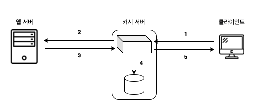
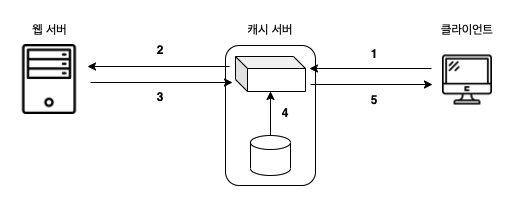

# 04. 캐시 서버를 이용한 서버의 부하 분산 

### 캐시 서버의 이용

여러 대의 웹 서버를 설치하는 것이 아니라 다른 방법으로 부하 분산을 하는 방법이 있다.  
데이터베이스 서버와 웹 서버 같은 역할에 따라 서버를 나누는 방법으로, 이러한 역할별 분산 처리 방법 중의 하나가 **캐시 서버**를 사용하는 방법이다.

캐시 서버는 프록시라는 구조를 사용하여 데이터를 캐시에 저장하는 서버이다.  
프록시는 웹 서버와 클라이언트 사이에서 웹 서버에 대한 액세스 동작을 중개하는 역할을 한다.  
액세스 동작을 중개할 때 웹 서버에서 받은 데이터를 디스크에 저장해 두고 웹 서버를 대신하여 데이터를 클라이언트에 반송하는 기능을 가지고 있다.  
이것을 캐시라고 부르며, 캐시 서버는 이 기능을 이용한다.

### 캐시 서버는 갱신일로 콘텐츠를 관리한다

캐시 서버를 사용할 때는 부하 분산 장치와 마찬가지로 캐시 서버를 웹 서버 대신 DNS 서버에 등록한다.

#### 캐시 서버에 데이터가 없는 경우



[1] 클라이언트에서 캐시 서버에 보낸 요청
```text
GET /dir1/sample1.html HTTP/1.1
...
Host: www.oh29oh29.co.kr
Connection: Keep-Alive
```

[2] 캐시 서버에서 웹 서버에 전송한 요청  
- 캐시 서버를 경유한 것을 나타내는 헤더 필드를 추가하고 URI 에서 전송 대상을 판단하여 전송
- 헤더 필드는 그다지 중요하지 않고 캐시 서버의 설정에 따라 붙이지 않는 경우도 존재함
```text
GET /dir1/sample1.html HTTP/1.1
...
Host: www.oh29oh29.co.kr
Connection: Keep-Alive
Via: 1.1 proxy.oh29oh29.co.kr
```

[3] 웹 서버에서 캐시 서버에 전송한 응답
- If-Modified-Since 를 추가하지 않는 경우(캐시에 데이터가 없는 경우) 또는 웹 서버에서 변경된 경우에는 데이터가 그대로 응답
```text
HTTP/1.1 200 OK
...
Connection: close
Content-Type: text/html

<html>
<head> ...
```

[5] 캐시 서버에서 클라이언트에 전송한 응답
- 캐시 서버를 경유한 것을 나타내는 Via 헤더가 붙은 것 이외에는 보통의 응답 메시지와 동일
```text
HTTP/1.1 200 OK
...
Connection: close
Content-Type: text/html
Via: 1.1 proxy.oh29oh29.co.kr

<html>
<head> ...
```

#### 캐시 서버에 데이터가 있는 경우



[2] 캐시 서버에서 웹 서버에 전송한 요청
- 캐시에 저장한 일시 이후 데이터가 변경되었는지 조사하는 헤더 필드가 부가되어 웹 서버에 전송
```text
GET /dir1/sample1.html HTTP/1.1
...
Host: www.oh29oh29.co.kr
Connection: Keep-Alive
If-Modified-Since: Wed, 21 Sep 2021 05:29:00 GMT
Via: 1.1 proxy.oh29oh29.co.kr
```

[3] 웹 서버에서 캐시 서버에 전송한 응답
- If-Modified-Since 의 일시 이후 변경이 없었던 경우에는 웹 페이지의 데이터가 아니라 변경이 없다는 의미의 메시지를 응답
```text
HTTP/1.1 304 Not Modified
...
Connection: close
```

### 프록시의 원점은 포워드 프록시이다

지금까지는 프록시라는 구조를 웹 서버에 두고 캐시 기능을 이용하는 것이지만, 클라이언트에 캐시 서버를 두는 방법도 있다.

캐시 서버에서 이용하는 프록시라는 구조는 원래 클라이언트에 두는 방법에서 시작되었다. 
이 유형이 프록시의 원형으로 **포워드 프록시**라고 한다.

포워드 프록시가 처음 등장했을 때 캐시를 이용하는 것이 목적이었다.  
서버에 설치하는 캐시 서버와 같지만, 당시의 포워드 프록시는 방화벽을 실현한다는 중요한 목적이 한 가지 더 있었다.

프록시는 요청의 내용을 조사한 후 전송하므로 요청의 내용에 따라 액세스가 가능한지 판단할 수 있다.  
패킷 필터링 방화벽이라면 판단 근거로 IP 주소나 포트 번호라는 정보만 사용하므로 이렇게까지 자세히 조건을 설정하는 것은 불가능하다.

포워드 프록시를 사용할 경우에는 보통 브라우저의 설정 화면에 준비되어 있는 프록시 서버라는 항목에 포워드 프록시의 IP 주소를 설정한다.

### 포워드 프록시를 개량한 리버스 프록시

포워드 프록시를 사용할 경우에는 브라우저에 대한 설정이 꼭 필요한데, 설정이 번거롭고 잘못 설정할 경우에는 브라우저가 제대로 작동하지 않는 장애의 원인이 되기도 한다.  

브라우저에 설정이 필요하다는 점은 이런 수고나 장애의 원인뿐만 아니라 다른 제약 사항이 되기도 한다.  
인터넷에 공개하는 웹 서버는 누가 액세스하는지 알 수 없고, 브라우저에 프록시를 설정할 수 없기 때문에 웹 서버의 바로 앞에 프록시를 두는 방법을 선택하지 않는다.

이에 따라 브라우저에 프록시를 설정하지 않아도 사용할 수 있도록 개량되었다.  
즉 요청 메시지의 URI 에 쓰여있는 디렉토리명과 전송 대상의 웹 서버를 대응시켜서 보통의 요청 메시지를 전송할 수 있도록 했다.  
이것이 서버에 설치하는 캐시 서버에 채택하고 있는 방식으로, **리버스 프록시**라고 부른다.

### 트랜스페어런트 프록시

캐시 서버에서 전송 대상을 판단하는 방법, 즉 요청 메시지에서 패킷의 헤더를 조사하는 방법이 있다.  
패킷의 맨 앞에 있는 IP 헤더에는 수신처 IP 주소가 기록되어 있으므로 이것을 조사하면 액세스 대상 웹 서버가 어디에 있는지 알 수 있는데, 이 방법을 **트랜스페어런트 프록시**라고 부른다.

이 방법이라면 보통의 요청 메시지를 전송할 수 있으므로 포워드 프록시처럼 브라우저에 설정할 필요가 없다.  
또한 전송 대상을 캐시 서버에 설정할 필요도 없고, 어느 웹 서버에서나 전송할 수 있다.

트랜스페어런트 프록시를 사용하면 사용자가 프록시의 존재를 알아차릴 필요가 거의 없다.  
따라서 HTTP 의 메시지를 전송한다는 구조에 대한 관심이 적어지고 캐시를 이용한다는 측면에서 비중이 높아지고 있다.