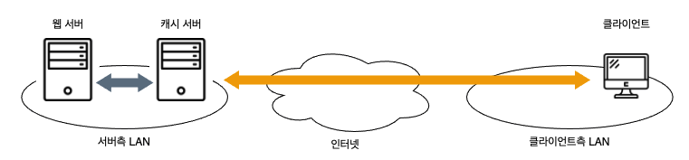
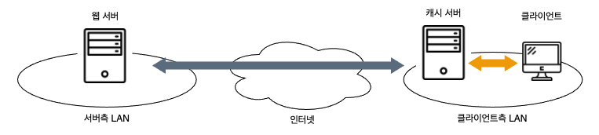
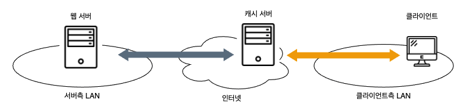
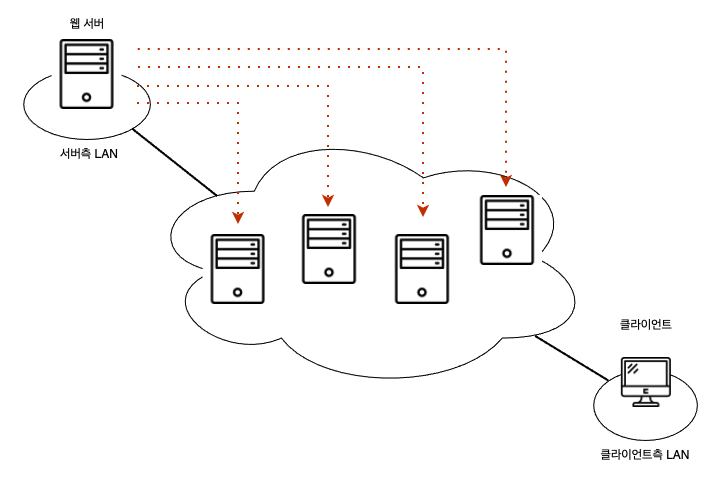

# 05. 콘텐츠 배포 서비스 

### 콘텐츠 배포 서비스를 이용한 부하 분산

캐시 서버는 서버측, 클라이언트측 어느 곳에 두느냐에 따라 이용 효과면에서 차이가 난다.

#### 웹 서버의 직전에 캐시 서버를 두는 경우

- 웹 서버의 부하를 억제하는 효과는 있지만 인터넷의 트래픽을 억제하는 효과는 없다.  
- 웹 서버 운영자가 캐시 서버를 관리할 수 있다.

#### 클라이언트측에 캐시 서버를 두는 경우

- 인터넷의 트래픽을 억제하는 효과는 높다.
- 클라이언트측에서 캐시 서버를 설치하므로 웹 서버 운영자가 캐시 서버를 관리할 수 없다.

캐시 서버는 놓는 장소에 따라 장단점이 있지만 양쪽의 좋은 점을 취한 방법도 있다.  
프로바이더와 계약하여 웹 서버 운영자가 제어할 수 있는 캐시 서버를 클아이언트측의 프로바이더에 두는 방법이다.

#### 인터넷의 주위에 캐시 서버를 두는 경우

- 인터넷의 트래픽을 억제하는 효과가 있다.
- 웹 서버 운영자가 캐시 서버를 제어할 수 있다.

하지만 이 방버에도 문제는 있다.  
인터넷에 공개하는 서버는 인터넷의 어디에서 액세스하는지 알 수 없다.  

이 문제를 해결하기 위해 먼저 중요한 프로바이더에 줌정을 두면 캐시 서버의 수를 줄일 수 있다.  
이렇게 하면 사용자에 따라서는 캐시 서버에 도착하기까지 먼 길을 거쳐야 한다.  
그래도 웹 서버에 직접 액세스하는 것보다는 여정을 단축할 수 있어서 나름 효과적이다.

그러나 또 한가지 문제가 있다.  
아무리 수를 줄여도 웹 서버 운영자가 스스로 프로바이더와 계약해서 캐시 서버를 설치하는 것은 보통 일이 아니다.

그래서 캐시 서버를 설치하고, 웹 서버 운영자에게 대출하는 서비스를 제공하는 사업자가 등장했는데, 이런 종류의 서비스를 콘텐츠 배포 서비스라고 한다.

### 가장 가까운 캐시 서버의 관점

콘텐츠 배포 서비스를 사용하는 경우에 인터넷 전체에 설치된 다수의 캐시 서버를 이용한다.  

이러한 상황에서는 다수가 있는 캐시 서버 중에서 가장 가까운 캐시 서버를 찾아내고, 클라이언트가 여기에 액세스하도록 중재하는 구조가 필요하다.

첫 번째 방법은,  
DNS 서버가 웹 서버의 IP 주소를 회답할 때 가장 가까운 캐시 서버의 IP 주소를 회답하도록 DNS 서버를 세밀하게 설정하는 방법이다.  
DNS 서버는 라운드 로빈 방식이 아니라 클라이언트와 캐시 서버의 거리를 판단하여 가장 가까운 캐시 서버의 IP 주소를 회답하도록 한다.

### 리피터용 서버로 액세스 대상을 분배한다

가장 가까운 캐시 서버에 액세스하는 방법은 한 가지가 더 있다.  
HTTP 의 사양에는 다양한 헤더 필드가 정의되어 있고, 이 중에서 `Location` 이라는 헤더가 있다.  
이것은 웹 서버의 데이터를 다른 서버로 옮기는 경우에 사용하는 것으로, '그 데이터는 이쪽의 서버에 있으므로 그쪽으로 다시 액세스하세요.' 라는 의미이다.

이렇게 해서 다른 웹 서버에 액세스하도록 처리하는 것을 리다이렉트라고 하며, 이것을 사용하여 액세스 대상을 가장 가까운 캐시 서버로 돌리는 것이 또 한가지 방법이다.

### 캐시 내용의 갱신 방법에서 성능의 차이가 난다

캐시 서버의 효율을 좌우하는 요소 중 캐시의 내용을 갱신하는 방법이 있다.

웹 서버에서 원래 데이터를 갱신할 경우 이것을 즉시 캐시 서버에 반영해야 한다.  
그러면 캐시의 데이터는 항상 최신의 상태를 유지할 수 있으므로 원래 데이터의 갱신을 확인할 필요가 없게 되고, 최초의 액세스 동작에도 캐시의 데이터를 이용할 수 있다.  
콘텐츠 배포 서비스에 이용하는 캐시 서버에는 이러한 대책이 내장되어 있다.