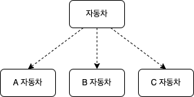
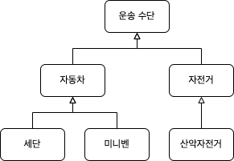
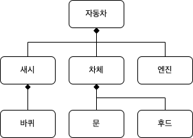

# 부록 A. 추상화 기법

### 추상화 기법

#### 분류와 인스턴스화

분류는 객체의 구체적인 세부 사항을 숨기고 인스턴스 간에 공유하는 공통적인 특성을 기반으로 범주를 형성하는 과정이다.  
분류의 역은 범주로부터 객체를 생성하는 인스턴스화 과정이다.

#### 일반화와 특수화

일반화는 범주 사이의 차이를 숨기고 범주 간에 공유하는 공통적인 특성을 강조한다.  
일반화의 역을 특수화라고 한다.

#### 집합과 분해

집합은 부분과 관련된 세부 사항을 숨기고 부분을 사용해서 전체를 형성하는 과정을 가리킨다.  
집합의 반대 과정은 전체를 부분으로 분리하는 분해 과정이다.

### 분류와 인스턴스화

#### 개념과 범주

객체를 분류하고 범주로 묶는 것은 객체들의 특정 집합에 공통의 개념을 적용하는 것을 의미한다.  
개념이란 속성과 행위가 유사한 객체에 공통적으로 적용되는 관념이나 아이디어다.

세상에 존재하는 객체에 개념을 적용하는 과정을 분류라고 한다.  
분류는 객체를 특정한 개념을 나타내는 집합의 구성 요소로 포함시킨다.

분류를 통해 개별 현상을 하나의 개념으로 다룬다.  
이때 '수많은 개별적인 현상들'을 객체라고 하고, '하나의 개념'을 타입이라고 한다.  
분류는 객체를 타입과 연관시키는 것이다.

#### 타입

- 심볼: 타입을 가리키는 간략한 이름이나 명칭
- 내연: 타입의 완전한 정의. 내연의 의미를 이용해 객체가 타입에 속하는지 여부를 확인할 수 있다.
- 외연: 타입에 속하는 모든 객체들의 집합

#### 외연과 집합

타입의 외연은 타입에 속하는 객체들의 집합으로 표현한다.  
집합은 외연을 가리키는 또 다른 명칭이다.  
객체들은 동시에 서로 다른 집합에 포함될 수도 있다.

#### 클래스

객체지향 프로그래밍 언어를 이용해 타입을 구현하는 가장 보편적인 방법은 클래스를 이용하는 것이다.  
클래스와 타입은 동일한 개념이 아니다.  
클래스는 타입을 구현하는 용도 외에도 코드를 재사용하는 용도로 사용되기도 한다.  
클래스 외에도 인스턴스를 생성할 수 없는 추상 클래스나 인터페이스를 이용해 타입을 구현할 수도 있다.

### 일반화와 특수화

#### 범주의 계층

좀 더 세부적인 범주가 계층의 하위에 위치하고 좀 더 일반적인 범주가 계층의 상위에 위치한다.  
이때 계층의 상위에 위치한 범주를 계층의 하위에 위치한 범주의 일반화라고 하고, 계층의 하위에 위치한 범주는 계층의 상위에 위차한 범주의 특수화라고 한다.

#### 서브타입

객체지향 세계에서 범주는 개념을 의미한다.  
개념은 타입을 의미하므로 일반화와 특수화는 계층 구조 안에 존재하는 타입 간의 관계를 의미한다.  
어떤 타입이 다른 타입보다 일반적이라면 이 타입을 슈퍼타입(supertype)이라고 한다.  
어떤 타입이 다른 타입보다 좀 더 특수하다면 이 타입을 서브타입(subtype)이라고 한다.  
슈퍼타입은 서브타입의 일반화이고 서브타입은 슈퍼타입의 특수화다.

#### 상속

프로그래밍 언어를 이용해 일반화와 특수화 관계를 구현하는 가장 일반적인 방법은 클래스 간의 상속을 사용하는 것이다.  
그러나 모든 상속 관계가 일반화 관계인 것은 아니다.  
두 클래스 간에 상속 관계가 존재할 때 이 관계를 반드시 일반화 관계라고 할 수는 없다.

일반화의 원칙은 한 타입이 다른 타입의 서브타입이 되기 위해서는 슈퍼타입에 순응해야 한다는 것이다.  
순응에는 구조적인 순응과 행위적인 순응이 있다.

상속은 서브타이핑(subtyping)과 서브클래싱(subclassing)의 두 가지 용도로 사용될 수 있다.  
서브클래스가 슈퍼클래스를 대체할 수 있는 경우를 서브타이핑이라고 한다.  
서브클래스가 슈퍼클래스를 대체할 수 없는 경우를 서브클래싱이라고 한다.  

서브타이핑은 설계의 유연성이 목표이지만 서브클래싱은 코드의 중복 제거와 재사용이 목적이다.  
흔히 서브타이핑을 인터페이스 상속이라고 하고, 서브클래싱을 구현 상속이라고 한다.

### 집합과 분해

#### 계층적인 복잡성

안정적인 형태의 부분으로부터 전체를 구축하는 행위를 집합이라고 하고 집합과 반대로 전체를 부분으로 분할하는 행위를 분해라고 한다.

집합의 가치는 많은 수의 사물들의 형상을 하나의 단위로 다룸으로써 복잡성을 줄일 수 있다는 데 있다.  
집합은 불필요한 세부 사항을 배제하고 큰 그림에서 대상을 다룰 수 있게 한다.  
즉, 불필요한 세부 사항을 추상화한다.  
그러나 필요한 시점에는 전체를 분해함으로써 그 안에 포함된 부분들을 새로운 전체로 다룰 수 있다.  
전체와 부분 간의 일관된 계층 구조는 재귀적인 설계를 가능하게 한다.

#### 합성 관계

객체와 객체 사이의 전체-부분 관계를 구현하기 위해서는 합성 관계를 사용한다.  
합성 관계는 부분을 전체 안에 캡슐화함으로써 인지 과부하를 방지한다.  

#### 패키지

소프트웨어의 전체적인 구조를 표현하기 위해 관련된 클래스 집합을 하나의 논리적인 단위로 묶는 구성 요소를 패키지 또는 모듈이라고 한다.

패키지를 이용하면 시스템의 전체적인 구조를 이해하기 위해 한 번에 고려해야 하는 요소의 수를 줄일 수 있다.  
클래스의 집합을 캡슐화함으로써 전체적인 복잡도는 낮출 수 있다.